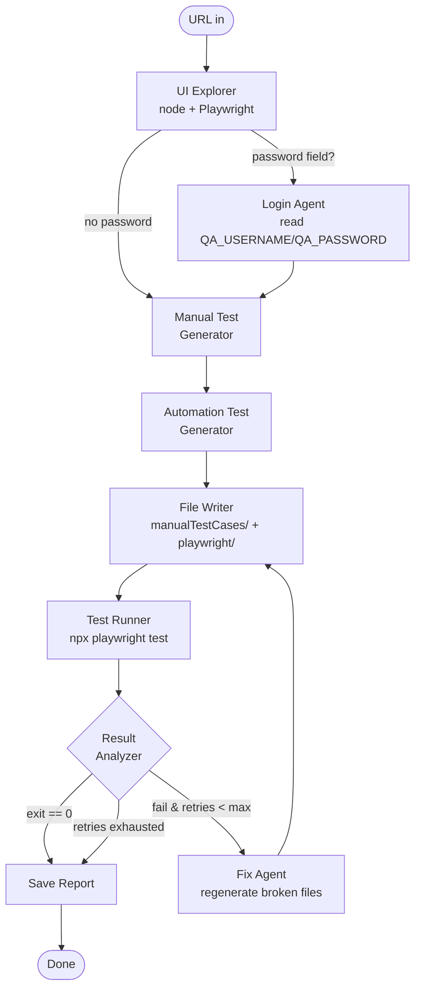

# QA Multi-Agent — Self-Healing Playwright Test Generator

> Point it at a URL. It explores the page, writes manual test cases, generates a full Playwright suite, runs the suite, and **fixes its own broken tests** until they pass.

Built with **LangGraph** for agent orchestration, the **Playwright CLI** for browser automation, and the **Claude Code CLI** as the LLM backend — **no API key required**.

---

## Why this exists

Most "AI test generation" demos stop at "look, it wrote a test." The interesting problem is what happens when that test breaks — wrong locator, missing wait, dynamic ID. This project closes the loop:

```
Generate -> Run -> If failed, read the error log -> Regenerate the broken file -> Run again
```

Up to `--max-retries` times (default 5). When a test passes, you keep it. When the budget is exhausted, you get a failure report you can hand to a human.

---

## Architecture



Nine cooperating agents, all wired together as a [LangGraph](https://github.com/langchain-ai/langgraph) `StateGraph` with two conditional edges (`route_login`, `route_test_result`).

| # | Agent | Role |
|---|---|---|
| 1 | **Orchestrator** | The graph itself — sequences nodes, routes on results. |
| 2 | **UI Explorer** | Drives a headless browser and emits a JSON summary of buttons / inputs / forms / links / tables. |
| 3 | **Login Agent** | Picks up credentials when a `<input type="password">` is detected. |
| 4 | **Manual Test Generator** | Writes Markdown test cases across positive / negative / validation / navigation / boundary categories. |
| 5 | **Automation Test Generator** | Emits Playwright JS specs and Page Objects using `===FILE: path===` blocks. |
| 6 | **Test Runner** | Invokes `npx playwright test` against just the specs we generated, on the chromium project. |
| 7 | **Result Analyzer** | Translates exit code + log tail into `passed` / `failed`. |
| 8 | **Fix Agent** | Reads the failing log, the UI structure, and the existing files; rewrites the broken ones. |
| 9 | **File Writer** | Persists every artifact to the right folder. |

---

## Features

- **Self-healing test loop** — failed Playwright runs feed straight back into the Fix Agent.
- **No API key** by default — uses your existing Claude Code authentication via `claude -p`.
- **Live log streaming** — every subprocess (Claude, Playwright, Node helper) tees its output to your main terminal with an `[agent]` prefix.
- **Page Object Model** — generator separates `pages/` from `tests/`, enforces `getByRole` / `getByLabel` / `getByPlaceholder` locator priority.
- **Hands-off integration** — drops files into your existing `playwright/` project; never touches `playwright.config.js`, `package.json`, or your other specs.
- **Retry budget** — `--max-retries N`; failure reports are saved when the budget runs out instead of looping forever.
- **Switchable backend** — set `QA_BACKEND=api` to call the Anthropic API directly (`langchain-anthropic`) when you'd rather pay per token than via your Claude Code subscription.

---

## Project structure

```
qa-multiagent/
├── agents/
│   ├── _llm.py                  # Claude Code CLI wrapper (default) / API fallback
│   ├── ui_explorer.py           # 1) UI Explorer
│   ├── login_agent.py           # 2) Login (env-driven creds)
│   ├── manual_agent.py          # 3) Manual Test Generator
│   ├── automation_agent.py      # 4) Automation Test Generator + ===FILE: parser
│   ├── test_runner.py           # 5) Test Runner
│   ├── result_analyzer.py       # 6) Result Analyzer
│   ├── fix_agent.py             # 7) Fix Agent
│   └── file_writer.py           # 8) File Writer
├── graph/
│   ├── state.py                 # QAState TypedDict
│   └── workflow.py              # StateGraph + route_login / route_test_result
├── tools/
│   ├── playwright_tool.py       # subprocess wrappers (npx, npm, node)
│   ├── extract_ui.js            # Node helper: drives Playwright, emits JSON
│   ├── process_utils.py         # streaming Popen helper (live tee)
│   └── file_utils.py            # write_text / read_prompt / format_prompt
├── prompts/
│   ├── manual_prompt.md
│   ├── automation_prompt.md
│   └── fix_prompt.md
├── output/reports/              # run reports land here
├── main.py                      # CLI entry point
├── requirements.txt
└── .env.example
```

External (siblings of `qa-multiagent/`):

```
manualTestCases/         # generated manual test cases (test_cases.md)
playwright/              # your pre-installed Playwright project
├── tests/               # generated Playwright specs land here
├── pages/               # generated Page Objects land here
├── playwright.config.js # untouched
└── package.json         # untouched
```

---

## Prerequisites

- **Python 3.10+**
- **Node 18+**
- **Claude Code CLI** installed and authenticated:
  ```bash
  npm install -g @anthropic-ai/claude-code
  claude            # log in once interactively, then exit
  claude --version  # sanity check
  ```
- A **Playwright project** at `playwright/` (or wherever `--project-dir` points). If you don't have one yet:
  ```bash
  mkdir playwright && cd playwright
  npm init -y
  npm install -D @playwright/test
  npx playwright install chromium
  npx playwright init       # generates playwright.config.js + tests/example.spec.js
  ```

---

## Setup

```bash
cd qa-multiagent
python -m venv .venv
.venv\Scripts\activate            # PowerShell:  .venv\Scripts\Activate.ps1
pip install -r requirements.txt

cp .env.example .env              # then edit QA_USERNAME / QA_PASSWORD if needed
```

That's it. No API key, no extra Node deps in `qa-multiagent/` — Playwright itself lives in your `playwright/` project.

---

## Usage

### Basic

```bash
python main.py https://example.com
```

### Against a real login flow

```bash
# One terminal: start the Angular AUT
cd ../backend && npm start --force

# Another terminal: aim the framework at it
cd qa-multiagent
python main.py http://localhost:4200/auth/login --max-retries 5
```

### CLI flags

| Flag | Default | Purpose |
|---|---|---|
| `url` (positional) | *prompted* | Page under test. |
| `--max-retries N` | `5` | Cap on fix-and-retry iterations before giving up. |
| `--manual-dir PATH` | `../manualTestCases` | Where `test_cases.md` is written. |
| `--project-dir PATH` | `../playwright` | Existing Playwright project root. |
| `--output PATH` | `output` | Where the run report is saved. |
| `--verbose` | `False` | DEBUG-level logging. |

---

## What you'll see

### Terminal output (abridged)

```
2026-04-26 17:42:01 [INFO] main: Starting QA workflow for http://localhost:4200/auth/login (max_retries=5)
2026-04-26 17:42:01 [INFO] agents.ui_explorer: UI Explorer: opening http://localhost:4200/auth/login
2026-04-26 17:42:04 [INFO] agents.ui_explorer: UI Explorer: 4 buttons / 3 inputs / 5 links — login_required=True
2026-04-26 17:42:04 [INFO] agents.login_agent: Login Agent: prepared credentials for test@example.com
2026-04-26 17:42:04 [INFO] agents.manual_agent: Manual Test Generator: drafting test cases
[manual] ### TC-001 — User logs in with valid credentials
[manual] **Category:** Positive
[manual] ...
[automation] ===FILE: pages/LoginPage.js===
[automation] const { expect } = require('@playwright/test');
[automation] class LoginPage { ...
[playwright] Running 6 tests using 1 worker
[playwright]   ✓ tests/login.spec.js:5:3 › valid credentials log in (1.4s)
[playwright]   ✗ tests/login.spec.js:14:3 › error on empty password (timed out)
2026-04-26 17:43:18 [WARNING] agents.result_analyzer: Result Analyzer: FAILED (exit=1)
2026-04-26 17:43:18 [INFO] agents.fix_agent: Fix Agent: repairing tests (retry 1)
[fix] ===FILE: tests/login.spec.js===
[fix] // ... corrected with getByRole('alert') instead of '.error-toast'
[playwright] Running 6 tests using 1 worker
[playwright]   ✓ all 6 passed (8.2s)

================================================================
 Status        : passed
 Retries used  : 2 / 5
 Manual tests  : ../manualTestCases/test_cases.md
 Playwright    : ../playwright
 Report        : output/reports/report.md
================================================================
```

### Sample manual test case

```markdown
### TC-003 — Login fails with empty password
**Category:** Negative
**Preconditions:** Browser is open at /auth/login.
**Steps:**
1. Type `test@example.com` in the Email field.
2. Leave the Password field empty.
3. Click the **Log In** button.
**Expected Result:** A "Password is required" validation error is shown
and the user remains on the login page.
```

### Sample generated spec

```js
// playwright/tests/login.spec.js
const { test, expect } = require('@playwright/test');
const { LoginPage } = require('../pages/LoginPage');

test.describe('Login', () => {
  test('logs in with valid credentials', async ({ page }) => {
    const login = new LoginPage(page);
    await login.goto();
    await login.fillEmail('test@example.com');
    await login.fillPassword('Password123!');
    await login.submit();
    await expect(page).toHaveURL(/dashboard|home|pages/i);
  });
});
```

### Sample run report (`output/reports/report.md`)

```markdown
# QA Automation Run Report
- **URL:** http://localhost:4200/auth/login
- **Status:** passed
- **Retries used:** 2 / 5
- **Login required:** True
```

---

## How the self-healing loop works

When `npx playwright test` exits non-zero, the Result Analyzer pulls the tail of stdout/stderr and stuffs it into `state.test_error`. The Fix Agent then receives:

1. The **failing log** (last ~4 KB).
2. The **current UI structure** from the explorer.
3. **Every existing file** the Automation Generator (or a previous Fix iteration) wrote.

Its prompt is a short triage checklist (locator mismatch ▸ timing ▸ navigation ▸ strictness ▸ assertion ▸ login flow). It re-emits the files it wants changed using the same `===FILE: path===` block format. Anything it doesn't re-emit is left as-is. The File Writer overwrites, the Test Runner runs again, and the cycle either converges or hits the retry budget.

This converges fast on real failures (locator typos, missing waits, dynamic IDs) and exits cleanly when it can't (genuinely broken AUT, network timeouts).

---

## Configuration

### Environment variables (`.env`)

| Var | Default | What it does |
|---|---|---|
| `QA_USERNAME` | `test@example.com` | Used by the Login Agent. |
| `QA_PASSWORD` | `Password123!` | Used by the Login Agent. |
| `QA_BACKEND` | `cli` | `cli` = Claude Code CLI; `api` = direct Anthropic API. |
| `ANTHROPIC_API_KEY` | — | Required only if `QA_BACKEND=api`. |
| `QA_MODEL` | `claude-sonnet-4-6` | Override the model on the API path. |
| `QA_DEBUG_PROMPT` | unset | Set to `1` to log the first 2000 chars of every prompt. |

### Switching to direct API mode

```bash
pip install langchain-anthropic
export QA_BACKEND=api
export ANTHROPIC_API_KEY=sk-ant-...
python main.py http://localhost:4200/auth/login
```

---

## Troubleshooting

| Symptom | Likely cause / fix |
|---|---|
| `Claude Code CLI not found on PATH` | Run `npm install -g @anthropic-ai/claude-code`, then `claude` once interactively to log in. |
| `extract_ui.js` fails immediately | Your `playwright/` project hasn't installed browsers yet — `cd playwright && npx playwright install chromium`. |
| `npx playwright test` runs the default `example.spec.js` and fails offline | Expected to be skipped — the Test Runner explicitly passes only the specs we generated. If you see it, your `--project-dir` may be wrong. |
| Tests fail with "page.goto: Cannot navigate to invalid URL" | Your `playwright.config.js` has no `baseURL` and a generated test slipped through with `goto('/')`. The shipped prompts force the full URL; if you've edited them, re-add `await page.goto('{url}')`. |
| Self-healing loop runs all 5 retries without converging | Inspect `output/reports/report.md` for the last stderr — usually a backend issue (auth service down, the AUT itself returning 500). |

---

## Roadmap

- Multi-page exploration (follow internal links and accumulate UI structure).
- Pluggable LLM backends (OpenAI, local Ollama).
- Auto-classification of failures (env vs. test bug) before invoking the Fix Agent.
- Visual regression hooks via Playwright's screenshot diffing.

---

## License

MIT — see `LICENSE` if present, or treat as MIT for the code in this directory.
